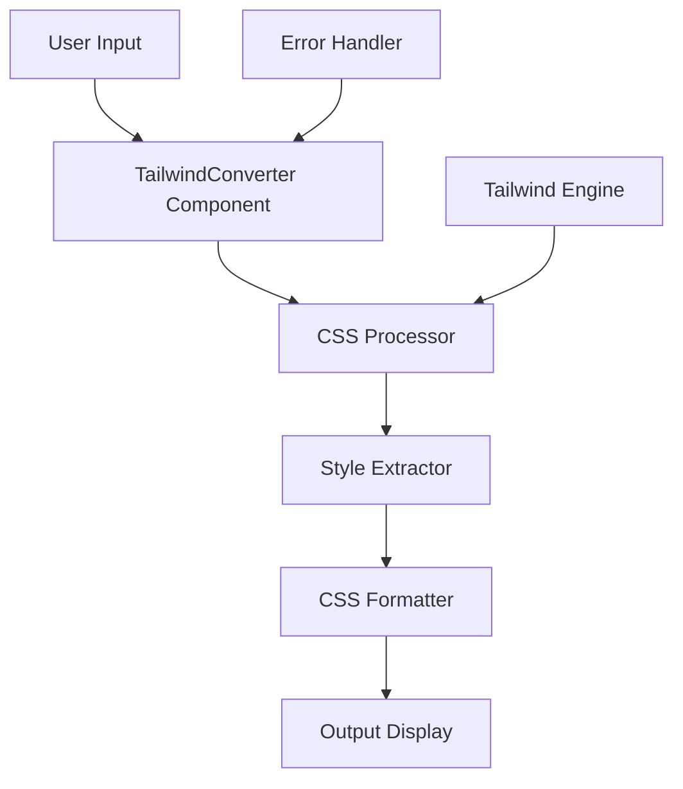

# Design Document

## Overview

The Tailwind to CSS converter will be built as a Next.js application with a clean, side-by-side interface. The application will leverage Tailwind's compilation process to convert utility classes into their equivalent CSS. The core approach involves creating a virtual DOM element with the Tailwind classes applied, then extracting the computed styles to generate the CSS output.

## Architecture

The application follows a client-side architecture with the following key components:



### Core Architecture Principles

1. **Client-side Processing**: All conversion happens in the browser to provide real-time feedback
2. **Component-based Design**: React components for modularity and reusability
3. **Real-time Updates**: Debounced input processing for smooth user experience
4. **Error Resilience**: Graceful handling of invalid Tailwind classes

## Components and Interfaces

### 1. Main Page Component (`page.tsx`)
- **Purpose**: Root component that renders the converter interface
- **Responsibilities**: Layout structure and component orchestration

### 2. TailwindConverter Component
- **Purpose**: Main converter interface with input/output panels
- **Props**: None (self-contained)
- **State**:
  - `inputValue: string` - Current Tailwind classes
  - `outputValue: string` - Generated CSS
  - `isProcessing: boolean` - Loading state
  - `error: string | null` - Error messages

### 3. InputPanel Component
- **Purpose**: Editable textarea for Tailwind class input
- **Props**:
  - `value: string`
  - `onChange: (value: string) => void`
  - `placeholder: string`

### 4. OutputPanel Component
- **Purpose**: Read-only display for generated CSS
- **Props**:
  - `value: string`
  - `isLoading: boolean`
  - `error: string | null`

### 5. CSSProcessor Service
- **Purpose**: Core conversion logic
- **Methods**:
  - `convertTailwindToCSS(classes: string): Promise<string>`
  - `extractComputedStyles(element: HTMLElement): CSSStyleDeclaration`
  - `formatCSS(styles: CSSStyleDeclaration): string`

## Data Models

### ConversionResult Interface
```typescript
interface ConversionResult {
  css: string;
  error?: string;
  warnings?: string[];
}
```

### ProcessorConfig Interface
```typescript
interface ProcessorConfig {
  debounceMs: number;
  maxInputLength: number;
  enableSyntaxHighlighting: boolean;
}
```

## Technical Implementation Strategy

### CSS Extraction Approach
1. **Virtual Element Creation**: Create a hidden DOM element with the Tailwind classes
2. **Style Computation**: Use `getComputedStyle()` to extract actual CSS values
3. **CSS Generation**: Convert computed styles back to CSS format
4. **Cleanup**: Remove virtual elements after processing

### Real-time Processing
- **Debouncing**: 300ms delay to prevent excessive processing
- **Background Processing**: Use Web Workers if needed for complex conversions
- **Caching**: Cache results for identical input to improve performance

### Error Handling Strategy
1. **Input Validation**: Check for valid Tailwind class patterns
2. **Graceful Degradation**: Show partial results when some classes are invalid
3. **User Feedback**: Clear error messages with suggestions
4. **Fallback**: Basic CSS output even when advanced features fail

## User Interface Design

### Layout Structure
```
┌─────────────────────────────────────────────────────────┐
│                    Header/Title                         │
├─────────────────────┬───────────────────────────────────┤
│                     │                                   │
│    Input Panel      │        Output Panel               │
│   (Tailwind)        │         (CSS)                     │
│                     │                                   │
│  ┌───────────────┐  │  ┌─────────────────────────────┐  │
│  │               │  │  │                             │  │
│  │  Editable     │  │  │     Read-only               │  │
│  │  Textarea     │  │  │     CSS Output              │  │
│  │               │  │  │                             │  │
│  └───────────────┘  │  └─────────────────────────────┘  │
│                     │                                   │
└─────────────────────┴───────────────────────────────────┘
```

### Responsive Design
- **Desktop**: Side-by-side panels (50/50 split)
- **Tablet**: Side-by-side with adjusted proportions
- **Mobile**: Stacked panels (input on top, output below)

### Visual Design Elements
- **Clean Interface**: Minimal design focusing on functionality
- **Syntax Highlighting**: Color-coded CSS output for readability
- **Loading States**: Subtle indicators during processing
- **Error States**: Clear visual feedback for issues

## Error Handling

### Input Validation
1. **Class Pattern Matching**: Validate against known Tailwind patterns
2. **Length Limits**: Prevent excessive input that could cause performance issues
3. **Special Character Handling**: Properly escape and handle special characters

### Processing Errors
1. **Partial Conversion**: Show results for valid classes even if some fail
2. **Error Messages**: Specific feedback about which classes are invalid
3. **Recovery Suggestions**: Suggest corrections for common mistakes

### System Errors
1. **Fallback Rendering**: Basic CSS output when advanced processing fails
2. **Error Boundaries**: React error boundaries to prevent app crashes
3. **Logging**: Client-side error logging for debugging

## Testing Strategy

### Unit Testing
- **Component Testing**: Test individual React components
- **Service Testing**: Test CSS conversion logic
- **Utility Testing**: Test helper functions and formatters

### Integration Testing
- **End-to-End Flow**: Test complete conversion process
- **Error Scenarios**: Test various error conditions
- **Performance Testing**: Test with large inputs and complex classes

### Manual Testing
- **Cross-browser Testing**: Ensure compatibility across browsers
- **Responsive Testing**: Test on various screen sizes
- **Accessibility Testing**: Ensure keyboard navigation and screen reader support

## Performance Considerations

### Optimization Strategies
1. **Debounced Input**: Prevent excessive processing during typing
2. **Memoization**: Cache conversion results for identical inputs
3. **Lazy Loading**: Load heavy dependencies only when needed
4. **Virtual Scrolling**: Handle large CSS outputs efficiently

### Memory Management
1. **DOM Cleanup**: Remove virtual elements after processing
2. **Event Listener Cleanup**: Proper cleanup of event listeners
3. **Cache Limits**: Implement LRU cache with size limits

## Security Considerations

### Input Sanitization
- **XSS Prevention**: Sanitize user input to prevent script injection
- **CSS Injection**: Validate CSS output to prevent malicious styles
- **Content Security Policy**: Implement CSP headers for additional protection

### Client-side Security
- **No Server Communication**: All processing happens client-side
- **Local Storage**: Avoid storing sensitive data in browser storage
- **Error Information**: Limit error details to prevent information disclosure